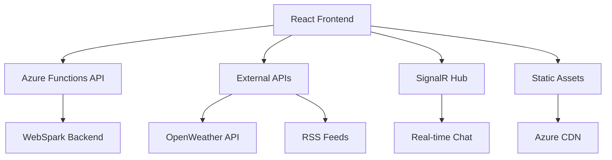

# ReactSparkPortfolio

<div align="center">

[](https://github.com/markhazleton/ReactSparkPortfolio?tab=MIT-1-ov-file)
[](https://github.com/markhazleton/ReactSparkPortfolio/stargazers)
[](https://github.com/markhazleton/ReactSparkPortfolio/issues)
[](https://github.com/markhazleton/ReactSparkPortfolio/actions)
[](https://github.com/markhazleton/ReactSparkPortfolio/network)
[](https://github.com/markhazleton/ReactSparkPortfolio/commits)

**🚀 A modern, high-performance React portfolio showcasing enterprise-grade web development**

[🌐 Live Demo](https://reactspark.markhazleton.com/) • [📖 Documentation](./documentation/) • [🔧 Admin Panel](./admin/) • [📋 Report Bug](https://github.com/markhazleton/ReactSparkPortfolio/issues)

</div>

---

## 🎯 Overview

**ReactSparkPortfolio** is a production-ready, enterprise-grade developer portfolio built with React 19, TypeScript, and Vite. It demonstrates modern frontend engineering best practices, serverless architecture, and cloud-native deployment patterns. The project serves as both a personal portfolio and a comprehensive reference implementation for scalable, maintainable web applications.

### ✨ Key Highlights

- 🎨 **Modern UI/UX** - Bootstrap 5 + custom SCSS with dark/light theme switching
- ⚡ **Performance First** - Vite + lazy loading + code splitting for optimal UX  
- 🔒 **Type Safety** - Full TypeScript implementation with strict mode
- 🌐 **Multi-Platform** - Dual deployment (Azure Static Web Apps + GitHub Pages)
- 🔄 **Real-time Features** - SignalR chat, live weather, dynamic content
- ♿ **Accessibility** - WCAG compliant with semantic HTML and ARIA
- 📱 **Responsive** - Mobile-first design that works on all devices
- 🚀 **CI/CD Ready** - Automated builds and deployments via GitHub Actions

---

## 🏗️ Architecture



---

## 🎭 Features

### 🎨 User Experience

- **🌓 Dark/Light Mode** - Persistent theme switching with smooth transitions
- **📱 Responsive Design** - Mobile-first approach with Bootstrap 5 components  
- **⚡ Fast Loading** - Optimized bundle size with lazy-loaded components
- **🔍 SEO Optimized** - Meta tags, Open Graph, JSON-LD structured data
- **♿ Accessible** - WCAG 2.1 AA compliant with keyboard navigation

### 💻 Technical Features  

- **🔄 Real-time Chat** - SignalR integration with multiple AI personalities
- **🌤️ Weather Widget** - Live weather data with interactive maps (Leaflet)
- **📰 RSS Integration** - Dynamic blog post feeds with XML parsing
- **🃏 Fun Elements** - Random jokes API integration
- **📊 Project Showcase** - Searchable, sortable portfolio with admin panel
- **🗺️ Interactive Maps** - Location-based weather visualization

### 🛠️ Developer Experience

- **🔧 Admin Interface** - Live project management with image browser
- **📝 TypeScript** - Strict type safety and IntelliSense support  
- **🧪 Modern Tooling** - ESLint, Prettier, SCSS compilation
- **📚 Documentation** - Comprehensive guides in `/documentation`
- **🔄 Hot Reload** - Instant development feedback with Vite

---

## 🛠️ Technology Stack

<details>
<summary><strong>🎯 Frontend Core</strong></summary>

- **React 19.1** - Latest React with concurrent features
- **TypeScript 5.9** - Type safety and modern JavaScript features  
- **Vite 7.0** - Lightning-fast build tool and development server
- **React Router 7.7** - Client-side routing and navigation

</details>

<details>
<summary><strong>🎨 Styling & UI</strong></summary>

- **Bootstrap 5.3.7** - Responsive component framework
- **SCSS/Sass 1.89** - Enhanced CSS with variables and mixins
- **React Bootstrap 2.10** - Bootstrap components for React
- **Bootstrap Icons 1.13** - Comprehensive icon library
- **Bootswatch 5.3** - Bootstrap theme variants

</details>

<details>
<summary><strong>🔧 State & Data</strong></summary>

- **React Context API** - Global state management
- **Axios 1.11** - HTTP client for API requests  
- **date-fns 4.1** - Modern date utility library
- **xml2js 0.6** - XML parsing for RSS feeds

</details>

<details>
<summary><strong>🌐 APIs & Integration</strong></summary>

- **SignalR 9.0** - Real-time web communication
- **OpenWeather API** - Weather data via WebSpark proxy
- **JokeAPI** - Entertainment content integration
- **Leaflet 1.9** - Interactive maps and geolocation

</details>

<details>
<summary><strong>☁️ Cloud & Deployment</strong></summary>

- **Azure Static Web Apps** - Serverless hosting with CDN
- **Azure Functions** - Serverless API endpoints  
- **GitHub Pages** - Alternative static hosting
- **GitHub Actions** - CI/CD automation

</details>

<details>
<summary><strong>🧹 Development Tools</strong></summary>

- **ESLint 9.32** - Code linting and quality
- **TypeScript ESLint** - TypeScript-specific linting
- **Concurrently** - Run multiple npm scripts  
- **rimraf** - Cross-platform file removal
- **ts-node** - TypeScript execution for scripts

</details>

---

## 📁 Project Structure

```
ReactSparkPortfolio/
├── 📱 src/                          # Source code
│   ├── 🧩 components/               # React components
│   │   ├── About.tsx               # About section with tech stack
│   │   ├── Articles.tsx            # RSS blog integration  
│   │   ├── Chat.tsx                # SignalR real-time chat
│   │   ├── Header.tsx              # Navigation with theme toggle
│   │   ├── Hero.tsx                # Landing page hero section
│   │   ├── Projects.tsx            # Portfolio project showcase
│   │   ├── WeatherForecast.tsx     # Weather widget with maps
│   │   └── ...                     # Additional components
│   ├── 🎨 scss/                    # SCSS styling
│   │   ├── components/             # Component-specific styles
│   │   ├── utilities/              # Custom utility classes  
│   │   ├── variables/              # SCSS variables and mixins
│   │   └── styles.scss             # Main stylesheet entry
│   ├── 🔧 contexts/                # React context providers
│   ├── 📊 data/                    # Static data files
│   ├── � services/                # API service layers
│   ├── 📝 models/                  # TypeScript interfaces
│   └── ⚙️ utils/                   # Utility functions
├── ☁️ api/                          # Azure Functions
│   └── proxy-rss/                  # RSS proxy function
├── 🎛️ admin/                       # Project management interface
├── 📖 documentation/               # Project documentation  
├── 🏗️ docs/                        # Production build output
├── ⚙️ .github/                     # GitHub workflows and templates
└── 📋 Configuration files          # Various config files
```

---

## 🚀 Quick Start

### 📋 Prerequisites

- **Node.js** 18+ ([Download](https://nodejs.org/))
- **npm** 9+ (comes with Node.js)
- **Git** ([Download](https://git-scm.com/))

### ⚡ Installation

```bash
# Clone the repository
git clone https://github.com/markhazleton/ReactSparkPortfolio.git
cd ReactSparkPortfolio

# Install dependencies
npm install

# Start development server
npm run dev
```

🎉 **That's it!** Open [http://localhost:3000](http://localhost:3000) to see the app.

### 🔧 Available Scripts

| Command | Description |
|---------|-------------|
| `npm run dev` | 🚀 Start development server with hot reload |
| `npm run build` | 📦 Build production bundle |
| `npm run preview` | 👀 Preview production build locally |
| `npm run lint` | 🔍 Lint codebase with ESLint |
| `npm run clean` | 🧹 Remove build artifacts and cache |
| `npm run build-css` | 🎨 Compile SCSS to CSS |
| `npm run watch-css` | 👁️ Watch and compile SCSS changes |
| `npm run generate-seo-files` | 📄 Generate sitemap.xml and robots.txt |

---

## 🌐 Deployment

### 🔵 Azure Static Web Apps (Recommended)

The project is configured for automatic deployment to Azure Static Web Apps:

1. **Automatic CI/CD** - Triggered on push to `main` branch
2. **Serverless API** - Azure Functions for backend services  
3. **Global CDN** - Worldwide content delivery
4. **Custom Domains** - SSL certificates included
5. **Preview Deployments** - Automatic PR previews

**Configuration Files:**

- `.github/workflows/azure-static-web-apps-*.yml` - GitHub Actions workflow
- `staticwebapp.config.json` - Azure SWA routing and settings
- `api/` - Azure Functions for serverless backend

### 🟢 GitHub Pages

Alternative deployment to GitHub Pages:

```bash
# Build and deploy to GitHub Pages
npm run build
git add docs/
git commit -m "Deploy to GitHub Pages"
git push origin main
```

**Setup:** Enable GitHub Pages in repository settings, source: `/docs` folder.

---

## 🎛️ Admin Panel

The project includes a full-featured admin interface for managing portfolio content:

### 🚀 Quick Start

```bash
# Navigate to admin directory
cd admin

# Install dependencies
npm install

# Start admin server
npm run dev
```

### ✨ Features

- 📝 **Project Management** - Add, edit, delete portfolio projects
- 🖼️ **Image Browser** - Visual image selection with previews
- 🔗 **URL Validation** - Real-time accessibility checking
- 📱 **Responsive Interface** - Works on all devices
- � **Data Persistence** - Projects saved to JSON file

**Access:** [http://localhost:3001](http://localhost:3001) (when admin server is running)

---

## 🧪 Testing & Quality

### 🔍 Code Quality

```bash
# Run linting
npm run lint

# Type checking
npx tsc --noEmit

# Check for outdated dependencies  
npm outdated
```

### 🛡️ Security

```bash
# Security audit
npm audit

# Fix vulnerabilities
npm audit fix
```

### ♿ Accessibility

- **Semantic HTML** - Proper heading hierarchy and landmarks
- **ARIA Labels** - Screen reader compatibility
- **Color Contrast** - WCAG 2.1 AA compliant
- **Keyboard Navigation** - Full keyboard accessibility

---

## 🤝 Contributing

We welcome contributions! Please see our [Contributing Guide](./documentation/CONTRIBUTING.md) for details.

### 🔄 Development Process

1. **Fork** the repository
2. **Create** a feature branch (`git checkout -b feature/amazing-feature`)
3. **Commit** your changes (`git commit -m 'Add amazing feature'`)
4. **Push** to the branch (`git push origin feature/amazing-feature`)
5. **Open** a Pull Request

### 📋 Issue Templates

- [� Bug Report](.github/ISSUE_TEMPLATE/bug_report.md)
- [✨ Feature Request](.github/ISSUE_TEMPLATE/feature_request.md)

---

## 📚 Documentation

- 📖 **[Complete Documentation](./documentation/)** - Comprehensive guides
- 🎛️ **[Admin Guide](./admin/README.md)** - Admin panel usage
- 🏗️ **[Architecture Guide](./documentation/ARCHITECTURE.md)** - System design
- 🚀 **[Deployment Guide](./documentation/DEPLOYMENT.md)** - Deployment options

---

## 🔗 Related Projects

- **[WebSpark](https://markhazleton.com)** - Backend API ecosystem
- **[PromptSpark](https://promptspark.markhazleton.com)** - AI prompt engineering
- **[DataSpark](https://dataspark.markhazleton.com)** - Data visualization platform

---

## 📈 Performance

- **Lighthouse Score:** 95+ across all metrics
- **Bundle Size:** <500KB gzipped
- **First Contentful Paint:** <1.5s
- **Time to Interactive:** <3s

---

## 🆘 Support

- � **Issues:** [GitHub Issues](https://github.com/markhazleton/ReactSparkPortfolio/issues)
- 💬 **Discussions:** [GitHub Discussions](https://github.com/markhazleton/ReactSparkPortfolio/discussions)
- 🐛 **Bug Reports:** Use the bug report template
- ✨ **Feature Requests:** Use the feature request template

---

## 📄 License

This project is licensed under the **MIT License** - see the [LICENSE](LICENSE) file for details.

---

## 🙏 Acknowledgments

- **React Team** - For the amazing framework
- **Microsoft Azure** - For excellent cloud services  
- **Bootstrap Team** - For the responsive framework
- **Vite Team** - For the lightning-fast build tool
- **Open Source Community** - For countless contributions

---

<div align="center">

**Built with ❤️ by [Mark Hazleton](https://markhazleton.com)**

[](https://github.com/markhazleton)
[](https://twitter.com/markhazleton)

[⭐ Star this repo](https://github.com/markhazleton/ReactSparkPortfolio) if you find it helpful!

</div>

- **Responsive Design**: Mobile-first, accessible, and optimized for all device sizes (Bootstrap 5.3)
- **Dark/Light Mode**: Theme toggle with persistent context-based state
- **Dynamic Content**: RSS feed integration, real-time weather, jokes, and chat
- **TypeScript**: Strict type safety and modern React patterns
- **SEO Optimized**: Meta tags, Open Graph, and JSON-LD structured data
- **Serverless Backend**: Azure Functions for API/data proxying
- **Dual Deployment**: GitHub Pages & Azure Static Web Apps (with CI/CD)
- **CI/CD**: Automated builds and deployments via GitHub Actions
- **Accessibility**: Semantic HTML, ARIA, and color contrast best practices
- **Performance**: Lazy loading, code splitting, and optimized assets

## 🛠️ Technology Stack

- **Frontend**: React 19.1, TypeScript 5.8, Vite 6.3
- **Styling**: Bootstrap 5.3.5, SCSS/Sass, React Bootstrap, Bootstrap Icons
- **State Management**: React Context API
- **Routing**: React Router v7.5
- **APIs**: Axios, OpenWeather, JokeAPI, SignalR (real-time chat), XML2JS (RSS)
- **Maps**: Leaflet & React Leaflet
- **Markdown**: React Markdown
- **Date Handling**: date-fns
- **Syntax Highlighting**: Prism.js
- **Serverless**: Azure Functions (API)
- **CI/CD**: GitHub Actions
- **Deployment**: Azure Static Web Apps, GitHub Pages

## 📁 Project Structure

```
ReactSparkPortfolio/
├── public/                  # Static assets
├── src/
│   ├── assets/             # Images, SVGs
│   ├── components/         # React components (hooks/, modules/)
│   ├── contexts/           # React context providers
│   ├── css/                # Compiled CSS
│   ├── data/               # Static data (JSON, XML)
│   ├── models/             # TypeScript interfaces/types
│   ├── scss/               # SCSS source files (components/, utilities/, variables/)
│   ├── services/           # API/data services
│   ├── App.tsx             # Main app
│   └── main.tsx            # Entry point
├── api/                    # Azure Functions (serverless API)
├── docs/                   # Production build output
├── .github/                # Workflows, issue/PR templates
├── scripts/                # Utility scripts (SEO, robots.txt, etc.)
├── vite.config.ts          # Vite config
├── tsconfig.json           # TypeScript config
├── staticwebapp.config.json# Azure SWA config
├── swa-cli.config.json     # SWA CLI config
└── package.json            # Dependencies & scripts
```

## 🚀 Getting Started

### Environment & Configuration

- **Node.js**: v18 or higher
- **npm**: v9+ recommended
- **.env files**: Supports environment-specific config via `.env`, `.env.development`, `.env.production`, etc. See `vite.config.ts` for details.
- **Required Variables**: (example)
  - `VITE_BASE_URL` - Base URL for the app
  - `OPENWEATHER_API_KEY` - (if using direct weather API)
  - See `vite.config.ts` and service files for more

### Installation

```pwsh
# Clone the repository
git clone https://github.com/markhazleton/ReactSparkPortfolio.git
cd ReactSparkPortfolio

# Install dependencies
npm install
```

### Scripts

| Script                | Description                                      |
|----------------------|--------------------------------------------------|
| `npm run dev`         | Start dev server with HMR and SCSS watcher       |
| `npm run build`       | Build production bundle (outputs to `docs/`)     |
| `npm run preview`     | Preview local production build                   |
| `npm run lint`        | Lint codebase with ESLint                        |
| `npm run clean`       | Remove build artifacts and cache                 |
| `npm run build-css`   | Compile SCSS to CSS                             |
| `npm run watch-css`   | Watch and auto-compile SCSS                     |
| `npm run generate-sitemap` | Generate sitemap.xml                        |
| `npm run generate-robots`  | Generate robots.txt                         |
| `npm run generate-seo-files` | Generate all SEO files                   |

### Development

```pwsh
npm run dev
# Open http://localhost:3000
```

### Linting & Code Quality

- **Lint**: `npm run lint` (uses ESLint, see `eslint.config.js`)
- **Type Checking**: TypeScript strict mode enabled
- **Formatting**: (Recommend using Prettier or VSCode default)

## 📦 Building for Production

```pwsh
npm run build
npm run preview # (optional, to preview build)
```

- Output is in `docs/` (for GitHub Pages & Azure SWA)

## 🧪 Testing

- _No automated tests included yet._
- **Manual Testing**: Use the live demo or local preview to verify features.
- **Recommended**: Add unit/integration tests with Jest, React Testing Library, or Cypress.

## 🌐 Deployment

### GitHub Pages

1. **Build**: `npm run build` (outputs to `docs/`)
2. **Push**: Commit and push `docs/` to `main` branch
3. **Enable Pages**: In GitHub repo settings, set Pages source to `/docs` on `main`
4. **Access**: `https://<your-username>.github.io/<repository-name>/`

### Azure Static Web Apps

1. **Config Files**:
   - `staticwebapp.config.json`, `swa-cli.config.json`, `.github/workflows/azure-static-web-apps-gentle-smoke-063be0b10.yml`

2. **CI/CD Workflow**: Automated publishing is handled by a GitHub Actions workflow:

   - **Trigger:** Runs on push and pull requests to the `main` branch.
   - **Jobs:**
     - `build_and_deploy_job`: Builds and deploys the app and API unless the PR is closed.
     - `close_pull_request_job`: Cleans up deployments when a PR is closed.

   **Key Steps:**
   1. **Checkout code:** Uses `actions/checkout@v3` with submodules.
   2. **Setup Node.js:** Uses `actions/setup-node@v3` (Node 18, npm cache).
   3. **Install dependencies:** Runs `npm ci` for clean install.
   4. **OIDC Client:** Installs `@actions/core` and `@actions/http-client` for authentication.
   5. **Get Id Token:** Uses `actions/github-script@v6` to retrieve an OIDC token for Azure authentication.
   6. **Build and Deploy:** Uses `Azure/static-web-apps-deploy@v1` with these settings:
      - `azure_static_web_apps_api_token`: Secure token from repo secrets
      - `action`: "upload"
      - `app_location`: `/` (root)
      - `api_location`: `api` (serverless API)
      - `output_location`: `docs` (Vite build output)
      - `app_build_command`: `npm run build`
      - `skip_app_build`/`skip_api_build`: false
      - `github_id_token`: OIDC token for secure deployment

   7. **Close PR Deployments:** When a PR is closed, the workflow runs a job to clean up preview deployments using the same Azure action.

   **Reference:** See `.github/workflows/azure-static-web-apps-gentle-smoke-063be0b10.yml` for the full workflow file.

3. **Local Dev**:

   ```pwsh
   npm install -g @azure/static-web-apps-cli
   swa start
   ```

4. **Features**:
   - Global CDN, SSL, serverless API, staging environments, advanced routing

## 🛡️ Maintenance & Updating

- **Dependencies**: Run `npm outdated` and `npm update` regularly
- **Security**: Use `npm audit` and keep dependencies patched
- **Azure Best Practices**: Use managed identity, never hardcode secrets, follow [Azure security guidance](https://learn.microsoft.com/en-us/azure/security/)
- **Accessibility**: Test with screen readers and color contrast tools
- **Performance**: Audit with Lighthouse, optimize images/assets

## ♿ Accessibility, Security & Performance

- **Accessibility**: Semantic HTML, ARIA, alt text, keyboard navigation, color contrast
- **Security**: No secrets in code, uses environment variables, follows Azure best practices
- **Performance**: Lazy loading, code splitting, optimized assets, CDN delivery

## 🤝 Contributing

Contributions are welcome!

- **Issues**: Use [GitHub Issues](https://github.com/markhazleton/ReactSparkPortfolio/issues)
- **Pull Requests**: Fork, branch, and submit PRs
- **Code Style**: Follow existing TypeScript/React patterns and lint rules
- **Templates**: See `.github/ISSUE_TEMPLATE/` for bug/feature templates

## ❓ FAQ & Troubleshooting

- **Q: Build fails on Windows?**
  - A: Ensure Node.js v18+, use PowerShell, and check for locked files in `node_modules`.
- **Q: Weather/Chat/API not working?**
  - A: Check environment variables and API keys.
- **Q: Styling issues?**
  - A: Run `npm run build-css` and ensure SCSS compiles without errors.
- **Q: How do I update dependencies?**
  - A: `npm update` and review changelogs for breaking changes.

## 🔍 SEO Implementation

- Semantic HTML5, meta tags, Open Graph, JSON-LD, canonical URLs, mobile-friendly, fast loading
- See `index.html` and SEO context for implementation details

## 📝 Blog Posts

- [Building My First React Site Using Vite and GitHub](https://markhazleton.com/articles/building-my-first-react-site-using-vite.html)
- [Adding Weather to My Profile Application](https://markhazleton.com/articles/adding-weather-component-a-typescript-learning-journey.html)
- [Using TypeScript with React: Lessons Learned](https://markhazleton.com/articles/using-typescript-with-react-lessons-learned.html)

## 📄 License

This project is licensed under the MIT License - see the [LICENSE](LICENSE) file for details.

## 📞 Support & Contact

- **Issues**: [GitHub Issues](https://github.com/markhazleton/ReactSparkPortfolio/issues)
- **Pull Requests**: Welcome!
- **General Questions**: Please use GitHub Issues for all support and contact

---

Built with ❤️ by the ReactSparkPortfolio community. [Report an issue](https://github.com/markhazleton/ReactSparkPortfolio/issues/new)
