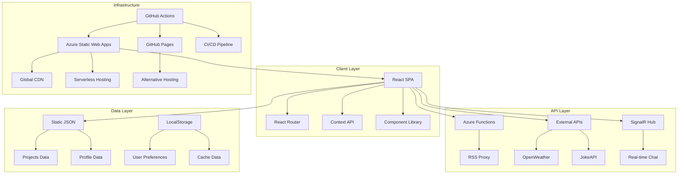
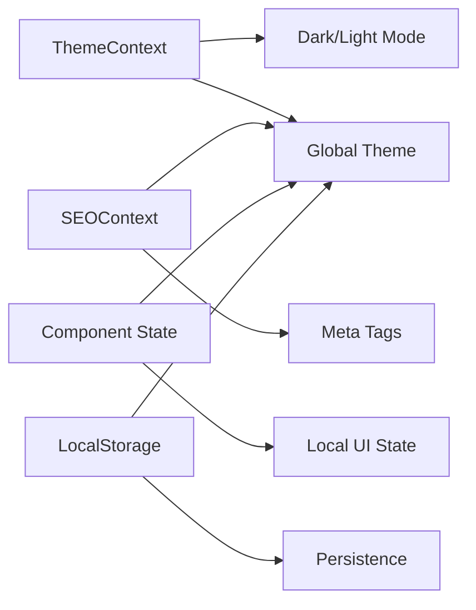
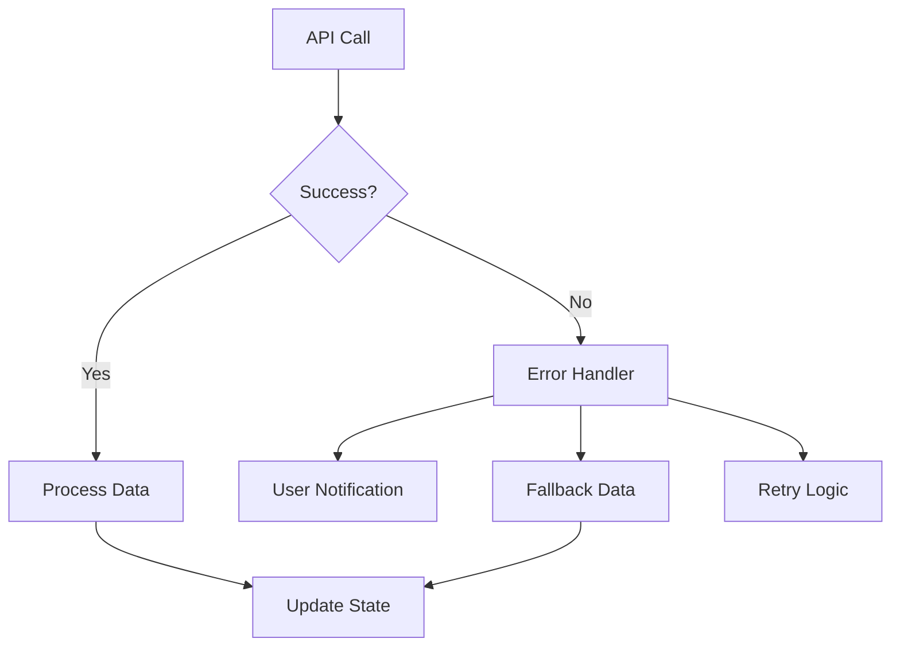
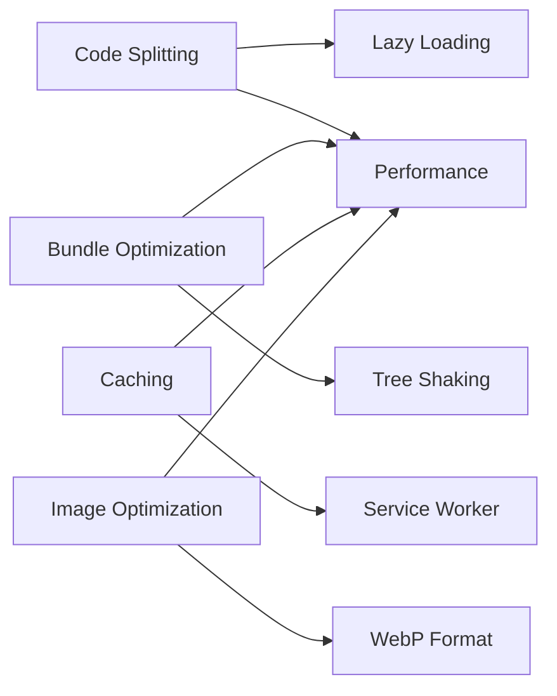
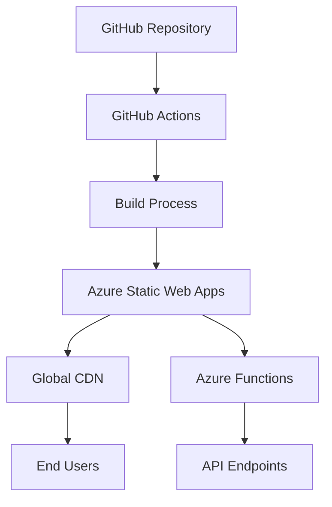
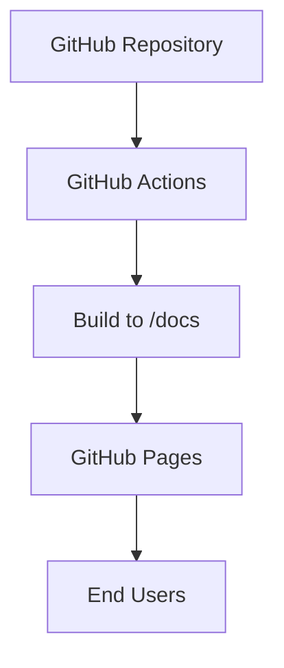

# System Architecture

## Overview

ReactSparkPortfolio follows a modern, cloud-native architecture that demonstrates enterprise-grade patterns for scalable web applications. The system is built with a clean separation of concerns, utilizing both client-side and serverless technologies.

## Architecture Diagram



## Component Architecture

### Frontend Components

```
src/components/
├── Layout Components
│   ├── Header.tsx          # Navigation with theme toggle
│   ├── Footer.tsx          # Site footer with links
│   └── NotFound.tsx        # 404 error page
├── Content Components
│   ├── Hero.tsx            # Landing page hero
│   ├── About.tsx           # About section
│   ├── Projects.tsx        # Portfolio showcase
│   └── Articles.tsx        # Blog integration
├── Interactive Components
│   ├── Chat.tsx            # SignalR real-time chat
│   ├── WeatherForecast.tsx # Weather widget
│   ├── MapComponent.tsx    # Interactive maps
│   └── Joke.tsx            # Entertainment component
└── Utility Components
    ├── VariantList.tsx     # AI personality selector
    └── Contact.tsx         # Contact information
```

### State Management



## Data Flow

### 1. Static Data Flow

```
JSON Files → TypeScript Models → React Components → UI Rendering
```

### 2. API Data Flow

```
User Action → Service Layer → External API → Response Processing → State Update → UI Update
```

### 3. Real-time Data Flow

```
SignalR Connection → Message Received → State Update → Component Re-render
```

## Service Layer Architecture

### API Services

```typescript
// Service Pattern
interface WeatherService {
  fetchWeather(location: string): Promise<WeatherData>;
  getCachedWeather(): WeatherData | null;
}

interface RSSService {
  fetchArticles(): Promise<Article[]>;
  parseRSSFeed(xml: string): Article[];
}
```

### Error Handling



## Security Architecture

### Client-Side Security

- **Content Security Policy (CSP)** - Prevent XSS attacks
- **Input Validation** - Sanitize user inputs
- **Environment Variables** - No secrets in frontend code
- **HTTPS Enforcement** - All communications encrypted

### API Security

- **CORS Configuration** - Controlled cross-origin requests
- **Rate Limiting** - Prevent API abuse
- **Authentication** - Azure AD integration where needed
- **Input Sanitization** - Server-side validation

## Performance Architecture

### Client-Side Optimization



### Build Optimization

- **Vite Bundling** - Fast builds with HMR
- **TypeScript Compilation** - Type checking and optimization
- **SCSS Compilation** - CSS optimization and minification
- **Asset Optimization** - Image compression and CDN delivery

## Deployment Architecture

### Azure Static Web Apps



### GitHub Pages (Alternative)



## Scalability Considerations

### Horizontal Scaling

- **CDN Distribution** - Global content delivery
- **Serverless Functions** - Auto-scaling API endpoints
- **Client-Side Rendering** - Reduced server load

### Vertical Scaling

- **Code Splitting** - Reduced initial bundle size
- **Lazy Loading** - On-demand component loading
- **Caching Strategies** - Browser and CDN caching

## Monitoring and Observability

### Frontend Monitoring

- **Performance Metrics** - Core Web Vitals tracking
- **Error Tracking** - Client-side error reporting
- **User Analytics** - Usage pattern analysis

### Backend Monitoring

- **Azure Monitor** - Function app performance
- **Application Insights** - Request tracing
- **Health Checks** - Endpoint availability

## Technology Decisions

### Why React?

- **Component Reusability** - Modular development
- **Strong Ecosystem** - Extensive library support
- **Performance** - Virtual DOM optimization
- **Developer Experience** - Excellent tooling

### Why TypeScript?

- **Type Safety** - Compile-time error detection
- **Developer Productivity** - Better IntelliSense
- **Maintainability** - Self-documenting code
- **Refactoring Support** - Safe code changes

### Why Vite?

- **Fast Development** - Hot module replacement
- **Modern Bundling** - ES modules support
- **Plugin Ecosystem** - Extensible build process
- **Production Optimization** - Efficient builds

### Why Azure Static Web Apps?

- **Serverless Hosting** - No infrastructure management
- **Global CDN** - Fast content delivery
- **Integrated CI/CD** - Seamless deployments
- **Cost Effective** - Pay-per-use pricing

## Future Architecture Considerations

### Potential Enhancements

- **PWA Features** - Offline functionality
- **GraphQL Integration** - Efficient data fetching
- **Micro-frontends** - Independent deployments
- **Edge Computing** - Closer user proximity

### Migration Paths

- **Database Integration** - Dynamic content management
- **Authentication System** - User accounts and profiles
- **Real-time Features** - More SignalR integrations
- **Mobile App** - React Native companion

---

This architecture provides a solid foundation for a modern, scalable web application while maintaining simplicity and developer productivity.
